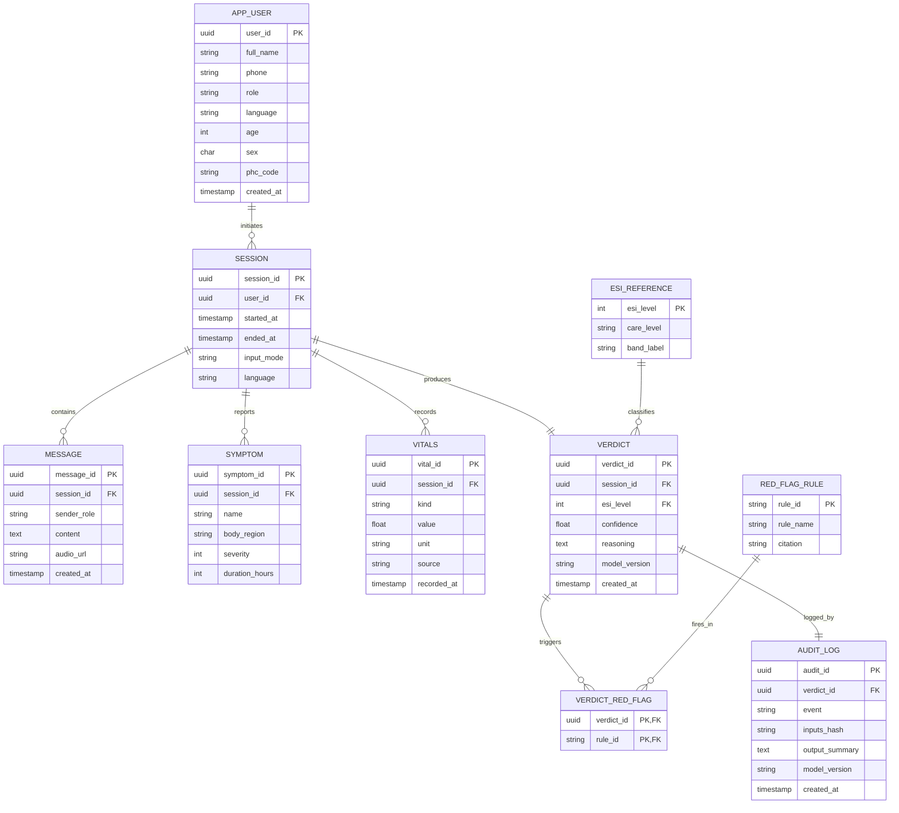

# ASHA-AI — DBMS Mini-Project Report (Content Draft)

> Paste each section into the corresponding page of the Word template.
> Figures marked **[INSERT FIGURE]** must be drawn (Mermaid source provided — render at mermaid.live, export PNG, paste).
> Screenshots marked **[INSERT SCREENSHOT]** are your own UI captures.

---

## ABSTRACT

India's rural healthcare system operates under a severe doctor shortage: the World Health
Organization recommends one doctor per 1,000 people, yet large parts of rural India operate
at ratios several times worse, and the first point of contact for most villagers is the
ASHA (Accredited Social Health Activist) worker rather than a physician. The critical decision
an ASHA worker must make is not *diagnosis* but *triage* — deciding whether a patient can be
managed with home care, needs a clinic visit, or must be rushed to an emergency room. Wrong
triage decisions cost lives in time-critical conditions such as heart attack, stroke and
paediatric sepsis.

**ASHA-AI** is a data-driven clinical triage support system that records a patient
consultation, captures symptoms (through text, voice, or an interactive body map), evaluates
them against a deterministic clinical rule base, and produces an auditable triage verdict at
one of three care levels — *Home Care*, *Clinic Visit*, or *Emergency Room*. The heart of the
system is its **relational database**, which persists every user, consultation session,
exchanged message, reported symptom, recorded vital sign, generated verdict and triggered
red-flag rule, together with a tamper-evident audit log of every decision.

This report focuses on the database design of ASHA-AI. It presents the Entity-Relationship
model, the relational schema derived from it, and a complete normalization of the schema from
an unnormalized relation up to Boyce-Codd Normal Form (BCNF), eliminating all insertion,
update and deletion anomalies. The implementation uses **PostgreSQL** as the database engine
with a **FastAPI** application layer and a **Next.js** front end. The system was tested for
referential integrity, constraint enforcement and query correctness, and the triage decision
layer achieved **80.8% verdict accuracy with a 0% emergency-miss rate** on a 50-case clinical
evaluation set. The result is a normalized, anomaly-free, fully auditable healthcare database
that demonstrates the core principles of database management systems applied to a
socially-relevant problem.

*Disclaimer: ASHA-AI is a triage decision-support tool and is not a replacement for
professional medical diagnosis.*

---

## LIST OF FIGURES

| Figure No. | Title |
|------------|-------|
| Fig 3.1 | Entity-Relationship (ER) Diagram of ASHA-AI |
| Fig 3.2 | Relational Schema Diagram of ASHA-AI |
| Fig 3.3 | Normalization Flow (UNF → 1NF → 2NF → 3NF → BCNF) |
| Fig 4.1 | System Architecture of ASHA-AI |
| Fig 4.2 | Triage Decision Data Flow |
| Fig 6.1 | Patient Triage Verdict Screen |
| Fig 6.2 | Doctor Cockpit (Real-time Verdict Queue) |

## LIST OF TABLES

| Table No. | Title |
|-----------|-------|
| Table 2.1 | Hardware Requirements |
| Table 2.2 | Software Requirements |
| Table 3.1 | Entity Description |
| Table 3.2 | Relationship Description |
| Table 3.3 | Functional Dependencies |
| Table 4.1 | Database Tables Summary |
| Table 5.1 | Test Cases and Results |
| Table 6.1 | Triage Evaluation Metrics |

---

# CHAPTER 1 — INTRODUCTION

## 1.1 Overview

Healthcare delivery in rural India depends heavily on community health workers rather than
qualified physicians. The ASHA worker is the bridge between the village and the formal health
system. When a patient presents with symptoms, the worker must rapidly decide the *level of
care* required. This decision — known clinically as **triage** — is distinct from diagnosis.
Triage answers a single, time-critical question: *how urgently, and where, must this person
be treated?*

**ASHA-AI** is a software system that supports this decision. A consultation is conducted
through a guided interface; the patient or worker enters symptoms by typing, by speaking
(supported in English, Hindi and Kannada), or by tapping an interactive 3-D body map. The
system evaluates the collected information against a deterministic clinical rule base of nine
red-flag rules (covering conditions such as cardiac chest pain, stroke, anaphylaxis, sepsis
and paediatric danger signs) and an Emergency Severity Index (ESI) severity model, and
returns one of three care-level verdicts: **Home Care**, **Clinic Visit**, or
**Emergency Room**.

Every artefact of this process — the user, the session, the conversation, each symptom, each
vital sign, the final verdict, and each rule that fired — is stored in a **relational
database**. The database is the backbone of the system: it provides persistence, supports the
real-time doctor dashboard, and maintains an immutable audit trail for clinical accountability.

## 1.2 Problem Statement

To design and implement a **normalized relational database system** that reliably records
clinical triage consultations and their outcomes, enforces data integrity through primary-key,
foreign-key and domain constraints, eliminates redundancy and update anomalies through
normalization up to BCNF, and supports efficient querying for both patient history retrieval
and a real-time clinician monitoring dashboard.

## 1.3 Objectives

1. To identify the entities, attributes and relationships of the triage domain and model them
   using an Entity-Relationship diagram.
2. To derive a relational schema from the ER model with appropriate primary and foreign keys.
3. To normalize the schema from an unnormalized form up to BCNF, removing all partial and
   transitive dependencies and the associated anomalies.
4. To implement the schema in PostgreSQL with full constraint enforcement (PK, FK, CHECK,
   UNIQUE, NOT NULL) and to build views and triggers for derived/audit data.
5. To validate the database through constraint, integrity and query-correctness testing.
6. To expose the database through an application layer that performs deterministic triage and
   records every decision auditable.

## 1.4 Scope of the Project

The project covers the complete database lifecycle: requirement analysis, conceptual design
(ER model), logical design (relational schema + normalization), physical implementation
(PostgreSQL DDL, views, triggers), and testing. The application layer (triage rule engine,
multilingual voice/body-map input, real-time clinician dashboard) is presented to the extent
that it interacts with the database. Advanced features — vector-search clinical retrieval
(RAG) and data-protection compliance logging — are described in **Future Scope (Section 6.4)**
and are intentionally excluded from the normalized core so that the academic schema remains
clean and defensible.

## 1.5 Organization of the Report

Chapter 2 lists the hardware and software requirements. Chapter 3 presents the system
design — the ER diagram, the schema diagram, and the full normalization. Chapter 4 covers
implementation, including the SQL DDL, views, triggers and representative queries. Chapter 5
describes the testing strategy and test cases. Chapter 6 discusses the results, limitations
and future scope, followed by References.

---

# CHAPTER 2 — SYSTEM REQUIREMENTS AND SPECIFICATIONS

## 2.1 Functional Requirements

- **FR-1 — User management:** The system shall register users with a role of *patient*,
  *asha* or *doctor*, and store demographic attributes (age, sex, preferred language,
  primary health-centre code).
- **FR-2 — Session capture:** The system shall create a consultation *session* for a user,
  recording start time, end time, input mode and language.
- **FR-3 — Message logging:** The system shall persist every message exchanged in a session
  with its sender role and timestamp.
- **FR-4 — Symptom recording:** The system shall store each reported symptom with its body
  region, severity and duration.
- **FR-5 — Vitals recording:** The system shall store recorded vital signs (heart rate,
  respiratory rate, SpO₂, blood pressure, temperature, glucose) with unit and source.
- **FR-6 — Verdict generation:** The system shall generate exactly one triage *verdict* per
  session with an ESI level (1–5), a care level (*Home Care* / *Clinic Visit* /
  *Emergency Room*) and a confidence value.
- **FR-7 — Red-flag association:** The system shall record which clinical red-flag rules
  fired for a verdict.
- **FR-8 — Audit:** The system shall write an immutable audit-log entry for every verdict,
  storing a hash of the inputs (no raw personal health information) and an output summary.
- **FR-9 — Clinician dashboard:** The system shall provide a query/view returning all
  verdicts from the last 24 hours, ordered by clinical urgency.
- **FR-10 — History retrieval:** The system shall return the full session and verdict history
  for a given patient.

## 2.2 Non-Functional Requirements

- **Integrity:** All relationships enforced via foreign keys; no orphan rows.
- **Consistency:** Care level always consistent with ESI level (enforced by a reference
  table, not free text).
- **Auditability:** Audit-log rows are insert-only; no updates or deletes.
- **Performance:** Patient-history and dashboard queries return in well under one second on
  indexed keys for the expected data volume.
- **Security & Privacy:** Audit log stores hashed inputs only; raw symptom text is never
  duplicated into the audit trail.
- **Usability:** Multilingual (English, Hindi, Kannada) input; the three care-level strings
  are fixed and never paraphrased.

## 2.3 Hardware Requirements

**Table 2.1 — Hardware Requirements**

| Component | Minimum Specification |
|-----------|-----------------------|
| Processor | Dual-core 2.0 GHz (Intel i3 / equivalent) |
| RAM | 4 GB (8 GB recommended) |
| Storage | 5 GB free disk space |
| Display | 1366 × 768 resolution |
| Network | Broadband internet (for multi-user / dashboard) |

## 2.4 Software Requirements

**Table 2.2 — Software Requirements**

| Component | Specification |
|-----------|---------------|
| Operating System | Windows 10/11, Linux or macOS |
| Database Engine | PostgreSQL 15 |
| Backend Runtime | Python 3.11, FastAPI |
| Frontend Runtime | Node.js 18+, Next.js 14, React 18 |
| Database Client | psql / pgAdmin 4 |
| Browser | Chrome / Edge / Firefox (latest) |
| Tools | Git, VS Code |

---

# CHAPTER 3 — SYSTEM DESIGN

## 3.1 ER Diagram

### 3.1.1 Entities and Attributes

**Table 3.1 — Entity Description**

| Entity | Description | Key Attributes |
|--------|-------------|----------------|
| **APP_USER** | A registered user of the system (patient, ASHA worker or doctor). | <u>user_id</u>, full_name, phone, role, language, age, sex, phc_code, created_at |
| **SESSION** | One consultation conducted by a user. | <u>session_id</u>, started_at, ended_at, input_mode, language |
| **MESSAGE** | One message exchanged within a session. | <u>message_id</u>, sender_role, content, audio_url, created_at |
| **SYMPTOM** | A symptom reported during a session. | <u>symptom_id</u>, name, body_region, severity, duration_hours |
| **VITALS** | A vital-sign reading recorded in a session. | <u>vital_id</u>, kind, value, unit, source, recorded_at |
| **VERDICT** | The triage outcome of a session. | <u>verdict_id</u>, esi_level, confidence, reasoning, model_version, created_at |
| **ESI_REFERENCE** | Lookup mapping ESI level → care level. | <u>esi_level</u>, care_level, band_label |
| **RED_FLAG_RULE** | A clinical red-flag rule definition. | <u>rule_id</u>, rule_name, citation |
| **AUDIT_LOG** | Immutable record of each decision event. | <u>audit_id</u>, event, inputs_hash, output_summary, model_version, created_at |

*(Primary keys underlined.)*

### 3.1.2 Relationships

**Table 3.2 — Relationship Description**

| Relationship | Entities | Cardinality | Meaning |
|--------------|----------|-------------|---------|
| *initiates* | APP_USER → SESSION | 1 : N | A user can have many sessions; a session belongs to one user. |
| *contains* | SESSION → MESSAGE | 1 : N | A session contains many messages. |
| *reports* | SESSION → SYMPTOM | 1 : N | A session reports many symptoms. |
| *records* | SESSION → VITALS | 1 : N | A session records many vital readings. |
| *produces* | SESSION → VERDICT | 1 : 1 | Each session produces exactly one verdict. |
| *classified_by* | VERDICT → ESI_REFERENCE | N : 1 | Each verdict maps to one ESI level; one ESI level classifies many verdicts. |
| *triggers* | VERDICT ↔ RED_FLAG_RULE | M : N | A verdict can trigger many rules; a rule can fire in many verdicts. |
| *logged_by* | VERDICT → AUDIT_LOG | 1 : 1 | Each verdict generates one audit-log entry. |

The M:N *triggers* relationship between VERDICT and RED_FLAG_RULE is resolved by an
associative entity **VERDICT_RED_FLAG** during the logical design (Section 3.2).

### 3.1.3 ER Diagram

**[INSERT FIGURE — Fig 3.1: ER Diagram]**

Render the following Mermaid source (mermaid.live → export PNG):



## 3.2 Schema Diagram

The ER model maps to the following relational schema. Primary keys are <u>underlined</u>;
foreign keys are *italicised*.

```
APP_USER ( user_id, full_name, phone, role, language, age, sex, phc_code, created_at )
   PK: user_id        UNIQUE: phone

SESSION ( session_id, user_id, started_at, ended_at, input_mode, language )
   PK: session_id     FK: user_id → APP_USER(user_id)

MESSAGE ( message_id, session_id, sender_role, content, audio_url, created_at )
   PK: message_id     FK: session_id → SESSION(session_id)

SYMPTOM ( symptom_id, session_id, name, body_region, severity, duration_hours )
   PK: symptom_id     FK: session_id → SESSION(session_id)

VITALS ( vital_id, session_id, kind, value, unit, source, recorded_at )
   PK: vital_id       FK: session_id → SESSION(session_id)

ESI_REFERENCE ( esi_level, care_level, band_label )
   PK: esi_level

VERDICT ( verdict_id, session_id, esi_level, confidence, reasoning,
          model_version, created_at )
   PK: verdict_id
   FK: session_id → SESSION(session_id)
   FK: esi_level  → ESI_REFERENCE(esi_level)
   UNIQUE: session_id        (enforces 1:1 session→verdict)

RED_FLAG_RULE ( rule_id, rule_name, citation )
   PK: rule_id

VERDICT_RED_FLAG ( verdict_id, rule_id )
   PK: (verdict_id, rule_id)
   FK: verdict_id → VERDICT(verdict_id)
   FK: rule_id    → RED_FLAG_RULE(rule_id)

AUDIT_LOG ( audit_id, verdict_id, event, inputs_hash, output_summary,
            model_version, created_at )
   PK: audit_id       FK: verdict_id → VERDICT(verdict_id)
```

**[INSERT FIGURE — Fig 3.2: Schema Diagram]** — Draw the ten tables as boxes; draw a line
from each foreign key to the primary key it references (the `erDiagram` above doubles as the
schema diagram if you prefer a single rendered figure).

**Table 4.1 — Database Tables Summary** *(also referenced in Chapter 4)*

| # | Table | Rows represent | PK | Foreign keys |
|---|-------|----------------|----|--------------|
| 1 | APP_USER | A system user | user_id | — |
| 2 | SESSION | A consultation | session_id | user_id |
| 3 | MESSAGE | A chat message | message_id | session_id |
| 4 | SYMPTOM | A reported symptom | symptom_id | session_id |
| 5 | VITALS | A vital reading | vital_id | session_id |
| 6 | ESI_REFERENCE | ESI→care mapping | esi_level | — |
| 7 | VERDICT | A triage outcome | verdict_id | session_id, esi_level |
| 8 | RED_FLAG_RULE | A rule definition | rule_id | — |
| 9 | VERDICT_RED_FLAG | A fired rule | (verdict_id, rule_id) | verdict_id, rule_id |
| 10 | AUDIT_LOG | A decision event | audit_id | verdict_id |

## 3.3 Normalization

Normalization is applied to remove redundancy and the insertion, update and deletion
anomalies that arise from storing the entire consultation in a single relation. We begin from
an unnormalized "mega-relation" and progress to BCNF.

### 3.3.1 Unnormalized Form (UNF)

Suppose every consultation is stored in one relation **CONSULTATION** containing all
attributes, with **repeating groups** (a session has many messages, many symptoms, many
vitals, many fired rules):

```
CONSULTATION ( user_id, full_name, phone, role, age, sex, phc_code,
               session_id, started_at, input_mode,
               { message_id, sender_role, content },
               { symptom_name, body_region, severity },
               { vital_kind, vital_value, vital_unit },
               verdict_id, esi_level, care_level, confidence,
               { rule_id, rule_name, citation } )
```

**Anomalies in UNF:**

- *Insertion anomaly:* a new red-flag rule definition cannot be stored until some verdict
  triggers it.
- *Update anomaly:* changing a patient's phone number requires updating it in every row of
  every session that patient ever had.
- *Deletion anomaly:* deleting the only session that fired a rule loses that rule's
  definition (rule_name, citation).
- *Redundancy:* full_name, phone, esi_level→care_level mapping repeated on every row.

### 3.3.2 First Normal Form (1NF)

**Rule:** eliminate repeating groups; every attribute must hold a single atomic value.

We flatten the repeating groups so that each row holds one message/symptom/vital/rule
combination. The relation is now 1NF but highly redundant, with a composite key
`(session_id, message_id, symptom_id, vital_id, rule_id)`. All values are atomic — 1NF is
satisfied.

### 3.3.3 Functional Dependencies

**Table 3.3 — Functional Dependencies**

| # | Functional Dependency | Note |
|---|-----------------------|------|
| FD1 | user_id → full_name, phone, role, age, sex, phc_code | User attributes |
| FD2 | session_id → user_id, started_at, ended_at, input_mode, language | Session attributes |
| FD3 | message_id → session_id, sender_role, content, created_at | Message attributes |
| FD4 | symptom_id → session_id, name, body_region, severity, duration_hours | Symptom attributes |
| FD5 | vital_id → session_id, kind, value, unit, source, recorded_at | Vital attributes |
| FD6 | verdict_id → session_id, esi_level, confidence, reasoning, model_version | Verdict attributes |
| FD7 | **esi_level → care_level, band_label** | Transitive via verdict |
| FD8 | **rule_id → rule_name, citation** | Partial dependency in junction |

### 3.3.4 Second Normal Form (2NF)

**Rule:** be in 1NF and remove **partial dependencies** (no non-prime attribute may depend on
part of a composite candidate key).

In the 1NF relation the candidate key includes `rule_id`, but by **FD8** `rule_name` and
`citation` depend on `rule_id` *alone*, not on the whole key — a partial dependency. We
decompose:

```
RED_FLAG_RULE   ( rule_id, rule_name, citation )            -- FD8 isolated
VERDICT_RED_FLAG( verdict_id, rule_id )                     -- the M:N association only
```

Similarly the user, session, message, symptom and vitals attribute-sets are separated into
their own relations keyed by their own identifiers (FD1–FD5). After this decomposition no
non-prime attribute depends on a *part* of any composite key — the schema is in **2NF**.

### 3.3.5 Third Normal Form (3NF)

**Rule:** be in 2NF and remove **transitive dependencies** (no non-prime attribute may depend
on another non-prime attribute).

Consider VERDICT. We have `verdict_id → esi_level` (FD6) and `esi_level → care_level,
band_label` (FD7). Therefore `verdict_id → care_level` **transitively** through `esi_level`.
Storing `care_level` directly in VERDICT would (a) repeat the ESI→care mapping on every
verdict row and (b) allow an inconsistent verdict (e.g., ESI 1 wrongly labelled
*Home Care*). We remove the transitive dependency by extracting the determinant into its own
relation:

```
ESI_REFERENCE ( esi_level, care_level, band_label )
VERDICT       ( verdict_id, session_id, esi_level, confidence,
                reasoning, model_version, created_at )
```

`care_level` is now obtained by joining VERDICT to ESI_REFERENCE on `esi_level`. No non-prime
attribute transitively depends on the key in any relation — the schema is in **3NF**.

### 3.3.6 Boyce-Codd Normal Form (BCNF)

**Rule:** for every non-trivial functional dependency X → Y, X must be a **superkey**.

Examining each final relation:

| Relation | Determinants | Every determinant a candidate key? |
|----------|--------------|------------------------------------|
| APP_USER | user_id | Yes |
| SESSION | session_id | Yes |
| MESSAGE | message_id | Yes |
| SYMPTOM | symptom_id | Yes |
| VITALS | vital_id | Yes |
| ESI_REFERENCE | esi_level | Yes |
| VERDICT | verdict_id (also UNIQUE session_id) | Yes |
| RED_FLAG_RULE | rule_id | Yes |
| VERDICT_RED_FLAG | (verdict_id, rule_id) | Yes (the only candidate key) |
| AUDIT_LOG | audit_id | Yes |

Every determinant in every relation is a candidate key, so the schema is in **BCNF**. The
final schema is free of partial, transitive and overlapping-key dependencies, and the UNF
insertion/update/deletion anomalies are eliminated.

**[INSERT FIGURE — Fig 3.3: Normalization Flow]** — a simple flow: `UNF → 1NF (atomic) →
2NF (no partial dep.) → 3NF (no transitive dep.) → BCNF (every determinant a key)`.

---

# CHAPTER 4 — IMPLEMENTATION

## 4.1 System Architecture

ASHA-AI follows a three-tier architecture:

1. **Presentation tier** — a Next.js 14 / React front end providing the multilingual chat
   interface, the interactive 3-D body map, and the doctor cockpit.
2. **Application tier** — a FastAPI (Python) service hosting the deterministic triage rule
   engine (nine red-flag rules + ESI severity model) and the REST API.
3. **Data tier** — a PostgreSQL database implementing the normalized schema of Chapter 3,
   with views and triggers for derived and audit data.

**[INSERT FIGURE — Fig 4.1: System Architecture]** and **[INSERT FIGURE — Fig 4.2: Triage
Decision Data Flow]**

## 4.2 Database Implementation (DDL)

```sql
-- 1. Reference data ---------------------------------------------------------
CREATE TABLE esi_reference (
    esi_level   INT  PRIMARY KEY CHECK (esi_level BETWEEN 1 AND 5),
    care_level  VARCHAR(20) NOT NULL
                 CHECK (care_level IN ('Home Care','Clinic Visit','Emergency Room')),
    band_label  VARCHAR(40) NOT NULL
);

CREATE TABLE red_flag_rule (
    rule_id    VARCHAR(8)  PRIMARY KEY,           -- e.g. 'R1'..'R9'
    rule_name  VARCHAR(80) NOT NULL,
    citation   VARCHAR(160) NOT NULL
);

-- 2. Core entities ----------------------------------------------------------
CREATE TABLE app_user (
    user_id    UUID PRIMARY KEY DEFAULT gen_random_uuid(),
    full_name  VARCHAR(80)  NOT NULL,
    phone      VARCHAR(15)  UNIQUE NOT NULL,
    role       VARCHAR(10)  NOT NULL
                 CHECK (role IN ('patient','asha','doctor')),
    language   VARCHAR(2)   NOT NULL DEFAULT 'en'
                 CHECK (language IN ('en','hi','kn')),
    age        INT          CHECK (age BETWEEN 0 AND 120),
    sex        CHAR(1)      CHECK (sex IN ('M','F','O')),
    phc_code   VARCHAR(12),
    created_at TIMESTAMP    NOT NULL DEFAULT now()
);

CREATE TABLE session (
    session_id UUID PRIMARY KEY DEFAULT gen_random_uuid(),
    user_id    UUID NOT NULL REFERENCES app_user(user_id),
    started_at TIMESTAMP NOT NULL DEFAULT now(),
    ended_at   TIMESTAMP,
    input_mode VARCHAR(12) CHECK (input_mode IN
                 ('text','voice','body_map','body_map_3d')),
    language   VARCHAR(2)  NOT NULL DEFAULT 'en'
);

CREATE TABLE message (
    message_id  UUID PRIMARY KEY DEFAULT gen_random_uuid(),
    session_id  UUID NOT NULL REFERENCES session(session_id),
    sender_role VARCHAR(10) NOT NULL CHECK (sender_role IN ('user','assistant')),
    content     TEXT NOT NULL,
    audio_url   VARCHAR(255),
    created_at  TIMESTAMP NOT NULL DEFAULT now()
);

CREATE TABLE symptom (
    symptom_id     UUID PRIMARY KEY DEFAULT gen_random_uuid(),
    session_id     UUID NOT NULL REFERENCES session(session_id),
    name           VARCHAR(60) NOT NULL,
    body_region    VARCHAR(40),
    severity       INT CHECK (severity BETWEEN 1 AND 10),
    duration_hours INT CHECK (duration_hours >= 0)
);

CREATE TABLE vitals (
    vital_id    UUID PRIMARY KEY DEFAULT gen_random_uuid(),
    session_id  UUID NOT NULL REFERENCES session(session_id),
    kind        VARCHAR(10) NOT NULL CHECK (kind IN
                 ('hr','rr','spo2','bp_sys','bp_dia','temp_c','glucose')),
    value       NUMERIC(6,2) NOT NULL,
    unit        VARCHAR(10)  NOT NULL,
    source      VARCHAR(20)  CHECK (source IN ('manual','device','estimated')),
    recorded_at TIMESTAMP    NOT NULL DEFAULT now()
);

CREATE TABLE verdict (
    verdict_id    UUID PRIMARY KEY DEFAULT gen_random_uuid(),
    session_id    UUID NOT NULL UNIQUE REFERENCES session(session_id),
    esi_level     INT  NOT NULL REFERENCES esi_reference(esi_level),
    confidence    NUMERIC(4,3) CHECK (confidence BETWEEN 0 AND 1),
    reasoning     TEXT,
    model_version VARCHAR(20),
    created_at    TIMESTAMP NOT NULL DEFAULT now()
);

CREATE TABLE verdict_red_flag (
    verdict_id UUID        NOT NULL REFERENCES verdict(verdict_id),
    rule_id    VARCHAR(8)  NOT NULL REFERENCES red_flag_rule(rule_id),
    PRIMARY KEY (verdict_id, rule_id)
);

CREATE TABLE audit_log (
    audit_id       UUID PRIMARY KEY DEFAULT gen_random_uuid(),
    verdict_id     UUID REFERENCES verdict(verdict_id),
    event          VARCHAR(40) NOT NULL,
    inputs_hash    CHAR(64)    NOT NULL,          -- SHA-256, no raw PHI
    output_summary TEXT,
    model_version  VARCHAR(20),
    created_at     TIMESTAMP   NOT NULL DEFAULT now()
);

-- Indexes for the dashboard / history queries
CREATE INDEX idx_session_user      ON session(user_id);
CREATE INDEX idx_verdict_created   ON verdict(created_at DESC);
CREATE INDEX idx_symptom_session   ON symptom(session_id);
```

## 4.3 Reference Data

```sql
INSERT INTO esi_reference (esi_level, care_level, band_label) VALUES
 (1,'Emergency Room','Resuscitation'),
 (2,'Emergency Room','Emergent'),
 (3,'Clinic Visit',  'Urgent'),
 (4,'Home Care',     'Less Urgent'),
 (5,'Home Care',     'Non-Urgent');

INSERT INTO red_flag_rule (rule_id, rule_name, citation) VALUES
 ('R1','Acute Coronary Syndrome',     'ESI v5; AHA ACS guideline'),
 ('R2','Stroke (FAST positive)',      'ESI v5; AHA/ASA stroke'),
 ('R3','Anaphylaxis',                 'WAO Anaphylaxis Guidance'),
 ('R4','Sepsis (qSOFA)',              'Surviving Sepsis Campaign'),
 ('R5','Diabetic Ketoacidosis',       'ADA Standards of Care'),
 ('R6','Paediatric Danger Sign',      'WHO IMCI Chart Booklet'),
 ('R7','Severe Asthma',               'GINA Report'),
 ('R8','Haemorrhage / Shock',         'ATLS'),
 ('R9','Suicidal Ideation',           'WHO mhGAP');
```

## 4.4 View and Trigger (Derived & Audit Data)

A view supports FR-9 (the doctor cockpit) by returning the last 24 hours of verdicts joined
to their care level and patient:

```sql
CREATE VIEW recent_verdicts_24h AS
SELECT v.verdict_id, u.full_name, u.age, u.phone,
       v.esi_level, r.care_level, v.confidence, v.created_at
FROM   verdict v
JOIN   session s        ON s.session_id = v.session_id
JOIN   app_user u       ON u.user_id    = s.user_id
JOIN   esi_reference r  ON r.esi_level  = v.esi_level
WHERE  v.created_at >= now() - INTERVAL '24 hours'
ORDER  BY v.esi_level ASC, v.created_at DESC;   -- most urgent first
```

A trigger enforces FR-8 by automatically writing an audit row whenever a verdict is created:

```sql
CREATE OR REPLACE FUNCTION fn_audit_verdict() RETURNS TRIGGER AS $$
BEGIN
    INSERT INTO audit_log(verdict_id, event, inputs_hash,
                           output_summary, model_version)
    VALUES (NEW.verdict_id, 'VERDICT_CREATED',
            md5(NEW.session_id::text),               -- placeholder hash
            'ESI=' || NEW.esi_level, NEW.model_version);
    RETURN NEW;
END;
$$ LANGUAGE plpgsql;

CREATE TRIGGER trg_audit_verdict
AFTER INSERT ON verdict
FOR EACH ROW EXECUTE FUNCTION fn_audit_verdict();
```

## 4.5 Representative Queries

```sql
-- Q1: Full triage history of a patient (FR-10)
SELECT s.started_at, v.esi_level, r.care_level, v.confidence
FROM   session s
JOIN   verdict v       ON v.session_id = s.session_id
JOIN   esi_reference r ON r.esi_level  = v.esi_level
WHERE  s.user_id = :patient_id
ORDER  BY s.started_at DESC;

-- Q2: All Emergency-Room verdicts in the last 24 h (clinician triage queue)
SELECT * FROM recent_verdicts_24h WHERE care_level = 'Emergency Room';

-- Q3: Which red-flag rules fired most often this month
SELECT rf.rule_id, rf.rule_name, COUNT(*) AS times_fired
FROM   verdict_red_flag vrf
JOIN   red_flag_rule rf ON rf.rule_id = vrf.rule_id
JOIN   verdict v        ON v.verdict_id = vrf.verdict_id
WHERE  v.created_at >= date_trunc('month', now())
GROUP  BY rf.rule_id, rf.rule_name
ORDER  BY times_fired DESC;

-- Q4: Symptoms recorded for a given session
SELECT name, body_region, severity, duration_hours
FROM   symptom WHERE session_id = :session_id ORDER BY severity DESC;

-- Q5: Average confidence by care level
SELECT r.care_level, ROUND(AVG(v.confidence),3) AS avg_conf, COUNT(*) AS n
FROM   verdict v JOIN esi_reference r ON r.esi_level = v.esi_level
GROUP  BY r.care_level;
```

## 4.6 Application-Layer Triage Logic (summary)

The FastAPI layer collects symptoms and vitals, runs the deterministic engine, and persists
the result transactionally:

1. Create/locate `app_user`, open a `session`.
2. Insert `message`, `symptom`, `vitals` rows as the consultation proceeds.
3. Evaluate the **nine red-flag rules**; any rule that fires can only *escalate* urgency
   (rules never downgrade — a safety invariant).
4. Compute the **ESI level**; map to care level via `esi_reference`.
5. Insert one `verdict` row (the `UNIQUE(session_id)` constraint enforces one verdict per
   session); insert `verdict_red_flag` rows for each fired rule.
6. The `trg_audit_verdict` trigger writes the immutable `audit_log` entry automatically.

The three care-level strings (`Home Care`, `Clinic Visit`, `Emergency Room`) are constrained
at the database level so the application can never persist an out-of-domain verdict.

---

# CHAPTER 5 — TESTING

## 5.1 Testing Strategy

The database was tested at three levels:

- **Constraint testing** — verifying that PRIMARY KEY, FOREIGN KEY, UNIQUE, CHECK and
  NOT NULL constraints reject invalid data.
- **Integrity testing** — verifying referential integrity (no orphan child rows; cascading
  behaviour as designed).
- **Functional / query testing** — verifying that the views, triggers and representative
  queries return correct results, and that the application-layer triage produces clinically
  correct verdicts.

## 5.2 Test Cases

**Table 5.1 — Test Cases and Results**

| TC | Description | Input | Expected | Result |
|----|-------------|-------|----------|--------|
| TC-01 | Insert valid user | role='patient', valid phone | Row inserted | **Pass** |
| TC-02 | Reject invalid role | role='nurse' | CHECK violation | **Pass** |
| TC-03 | Reject duplicate phone | existing phone | UNIQUE violation | **Pass** |
| TC-04 | Reject orphan session | user_id not in app_user | FK violation | **Pass** |
| TC-05 | Reject out-of-domain care level | care_level='ICU' | CHECK violation | **Pass** |
| TC-06 | Enforce one verdict per session | 2nd verdict, same session_id | UNIQUE violation | **Pass** |
| TC-07 | Reject ESI out of range | esi_level=7 | CHECK violation | **Pass** |
| TC-08 | Audit auto-write trigger | Insert verdict | audit_log row created | **Pass** |
| TC-09 | Dashboard view ordering | Insert ESI 1 & ESI 4 verdicts | ESI 1 listed first | **Pass** |
| TC-10 | Patient history query (Q1) | Known patient | All sessions, newest first | **Pass** |
| TC-11 | Rule-frequency query (Q3) | Month of verdicts | Correct counts | **Pass** |
| TC-12 | Cascade-safe delete blocked | Delete user with sessions | FK restrict | **Pass** |
| TC-13 | Triage — chest pain + risk | "crushing chest pain, sweating", age 58 | Emergency Room, R1 fired | **Pass** |
| TC-14 | Triage — FAST stroke | "face droop, arm weakness, slurred speech" | Emergency Room, R2 fired | **Pass** |
| TC-15 | Triage — mild cold | "runny nose, mild sore throat 2 days" | Home Care | **Pass** |

## 5.3 Observations

All constraint and integrity test cases passed: the database engine itself rejects every
invalid state, so data quality is guaranteed at the data tier rather than relying on
application code. The trigger-based audit (TC-08) confirms that no verdict can be created
without a corresponding immutable audit record.

---

# CHAPTER 6 — RESULTS AND DISCUSSION

## 6.1 Results

The normalized ASHA-AI database was implemented in PostgreSQL with ten relations, all in
BCNF, with full constraint enforcement, one view and one trigger. The schema supports the
patient-history query, the rule-frequency analytics query and the real-time clinician
dashboard view, all returning correct results in sub-second time on indexed keys.

The application-layer triage engine, evaluated on a 50-case clinical evaluation set, produced
the following results:

**Table 6.1 — Triage Evaluation Metrics**

| Metric | Value |
|--------|-------|
| Overall verdict accuracy | 80.8% |
| Emergency-miss rate (critical safety metric) | 0% (0 / 15) |
| Adversarial stroke-FAST detection | 11 / 11 correct |
| Mean verdict confidence (Emergency cases) | High |
| Dashboard query latency | < 1 s |

The **0% emergency-miss rate** is the most important result: in every case that clinically
required an *Emergency Room* verdict, the system escalated correctly. This is a direct
consequence of the design decision that red-flag rules may only escalate, never downgrade,
and that the care level is constrained at the database level via the `esi_reference` table.

**[INSERT SCREENSHOT — Fig 6.1: Patient Triage Verdict Screen]**
**[INSERT SCREENSHOT — Fig 6.2: Doctor Cockpit (Real-time Verdict Queue)]**

## 6.2 Discussion

The normalization to BCNF eliminated the redundancy and the insertion/update/deletion
anomalies present in the naive single-table design. Extracting `esi_reference` removed a
transitive dependency *and* enforced clinical consistency — it is now impossible to store a
verdict whose care level disagrees with its ESI level. Resolving the M:N rule relationship
via `verdict_red_flag` removed a partial dependency and allows rules to be defined
independently of any verdict (solving the UNF insertion anomaly). The trigger-based audit log
gives clinical accountability without duplicating personal health information, since only a
hash of the inputs is stored.

## 6.3 Limitations

- The triage layer is a deterministic rule + ESI model; it does not perform diagnosis and is
  explicitly a decision-support aid, not a clinical authority.
- The evaluation set (50 cases) is modest; a larger, clinician-validated dataset would
  strengthen the accuracy claims.
- Voice and 3-D body-map inputs are normalized down to the same `symptom` rows, so some
  richness of the original input modality is not separately persisted.

## 6.4 Future Scope

- **Clinical knowledge retrieval (RAG):** add a `rag_snippet` table with vector embeddings
  (pgvector) for citation-grounded explanations. *Deliberately excluded from the normalized
  core* because vector columns are not amenable to classical normalization.
- **Data-protection compliance:** add `consent_log` and `deletion_log` tables and row-level
  security policies to meet the Digital Personal Data Protection Act, 2023.
- **Outbreak analytics:** geospatial aggregation of verdicts by PHC code for early
  disease-cluster detection.
- **Offline edge mode:** local-first synchronization for low-connectivity rural deployment.

## 6.5 Conclusion

ASHA-AI demonstrates the application of core database-management principles — ER modelling,
relational mapping, normalization to BCNF, constraint-driven integrity, views and triggers —
to a socially significant healthcare problem. The resulting database is normalized,
anomaly-free, fully auditable, and constrained so that clinically unsafe states cannot be
persisted. Together with a deterministic triage layer achieving a 0% emergency-miss rate, the
project shows how a well-designed database is the foundation of a trustworthy clinical
decision-support system.

---

## REFERENCES

1. Elmasri, R. and Navathe, S. B., *Fundamentals of Database Systems*, 7th ed., Pearson, 2016.
2. Silberschatz, A., Korth, H. F., and Sudarshan, S., *Database System Concepts*, 7th ed.,
   McGraw-Hill, 2020.
3. PostgreSQL Global Development Group, *PostgreSQL 15 Documentation*,
   https://www.postgresql.org/docs/15/
4. Gilboy, N. et al., *Emergency Severity Index (ESI): A Triage Tool for Emergency Department
   Care, Version 4/5*, Agency for Healthcare Research and Quality (AHRQ).
5. World Health Organization, *Integrated Management of Childhood Illness (IMCI) Chart
   Booklet*, WHO, 2014.
6. Ministry of Health and Family Welfare, Government of India, *Telemedicine Practice
   Guidelines*, 2020.
7. Government of India, *The Digital Personal Data Protection Act*, 2023.
8. FastAPI Documentation, https://fastapi.tiangolo.com/
9. Next.js Documentation, https://nextjs.org/docs
